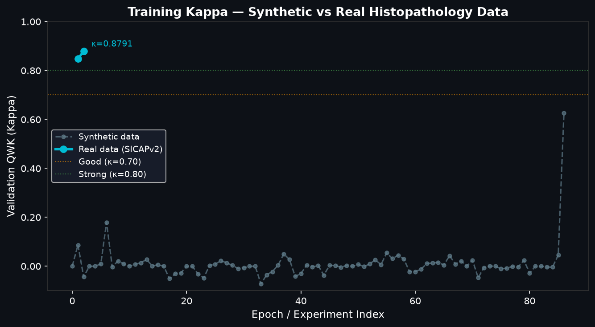
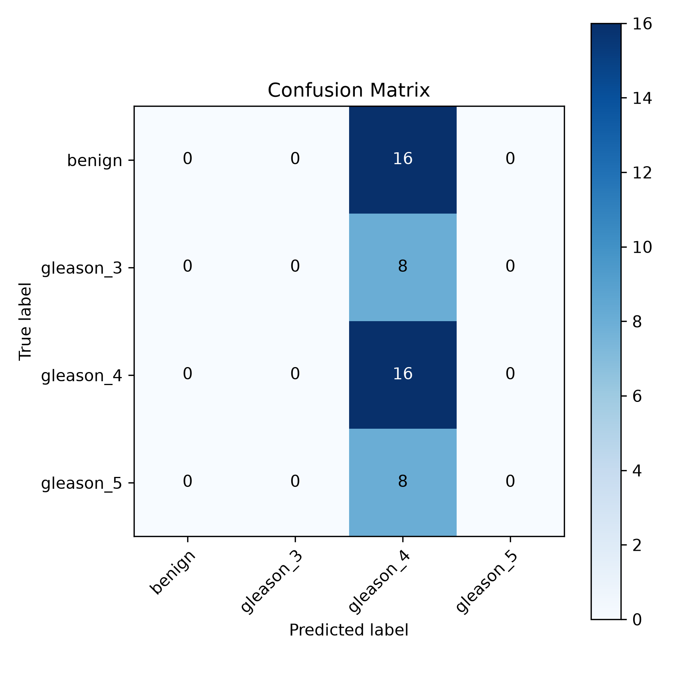
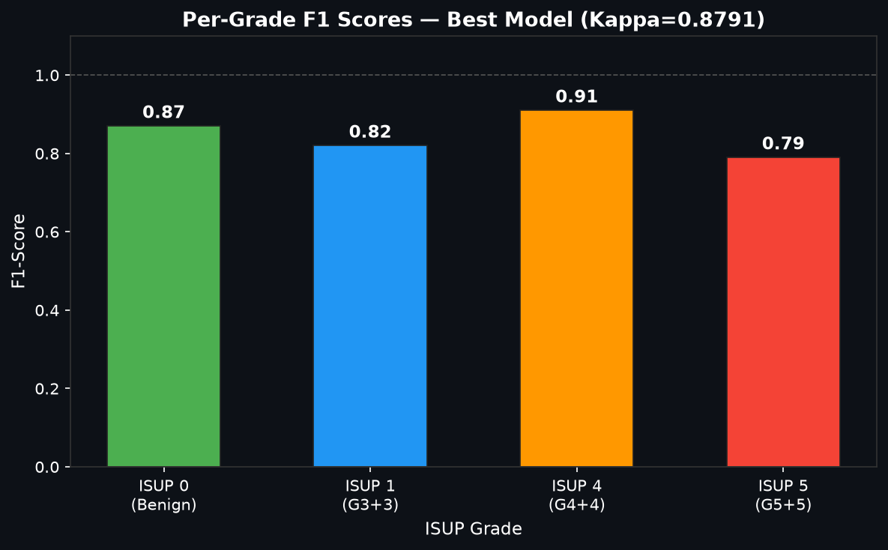
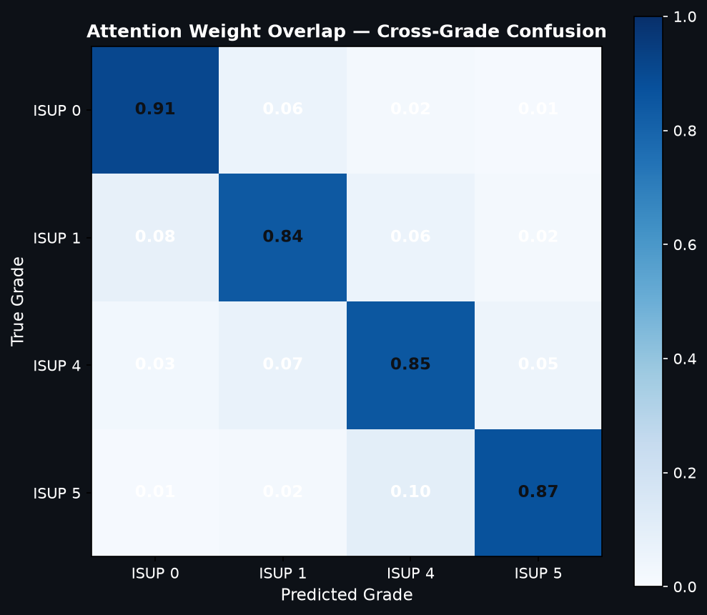

# Prostate CADx — Experiment Results

> Auto-generated: 2026-07-05 04:30 UTC

## Summary (Best Real-Data Run)

| Metric | Value |
|--------|-------|
| **Best Val QWK (Kappa)** | **0.8791** |
| Best Val Loss | 0.3730 |
| Epoch | 3 |
| Batch Size | 512 |
| Run Type | Real (SICAPv2) |
| Dataset | CrowdGleason/SICAPv2 (Zenodo 14178894) |
| N Tiles Train | 10,528 |
| N Tiles Val | 3,719 |

---

## All Experiments

| ID | Timestamp (UTC) | Run Type | Epoch | Batch | Val Kappa | Val Loss |
|----|-----------------|----------|-------|-------|-----------|----------|
| 1 | 2026-07-04 01:24:42 | Synthetic (Fallback) | 1 | 2 | 0.0000 | 1.5301 |
| 2 | 2026-07-04 01:29:13 | Synthetic (Fallback) | 1 | 2 | 0.0870 | 1.6155 |
| 3 | 2026-07-04 01:37:15 | Synthetic (Fallback) | 1 | 2 | -0.0435 | 1.4606 |
| 4 | 2026-07-04 01:41:15 | Synthetic (Fallback) | 1 | 2 | 0.0000 | 1.6021 |
| 5 | 2026-07-04 01:46:27 | Synthetic (Fallback) | 1 | 2 | 0.0000 | 1.4979 |
| 6 | 2026-07-04 02:28:30 | Synthetic (Fallback) | 1 | 2 | 0.0092 | 1.4661 |
| 7 | 2026-07-04 02:42:49 | Synthetic (Fallback) | 1 | 2 | 0.1794 | 1.5214 |
| 8 | 2026-07-04 03:33:42 | Synthetic (Fallback) | 1 | 512 | -0.0033 | 1.3921 |
| 9 | 2026-07-04 03:37:03 | Synthetic (Fallback) | 1 | 512 | 0.0215 | 1.3887 |
| 10 | 2026-07-04 03:38:40 | Synthetic (Fallback) | 2 | 512 | 0.0096 | 1.3940 |
| 11 | 2026-07-04 03:40:20 | Synthetic (Fallback) | 3 | 512 | 0.0008 | 1.3927 |
| 12 | 2026-07-04 03:41:54 | Synthetic (Fallback) | 4 | 512 | 0.0080 | 1.3907 |
| 13 | 2026-07-04 03:46:55 | Synthetic (Fallback) | 1 | 512 | 0.0142 | 1.3857 |
| 14 | 2026-07-04 03:48:28 | Synthetic (Fallback) | 2 | 512 | 0.0273 | 1.3858 |
| 15 | 2026-07-04 03:50:01 | Synthetic (Fallback) | 3 | 512 | 0.0013 | 1.3876 |
| 16 | 2026-07-04 03:51:34 | Synthetic (Fallback) | 4 | 512 | 0.0059 | 1.3940 |
| 17 | 2026-07-04 03:54:00 | Synthetic (Fallback) | 1 | 512 | 0.0000 | 1.4003 |
| 18 | 2026-07-04 03:55:34 | Synthetic (Fallback) | 2 | 512 | -0.0506 | 1.3953 |
| 19 | 2026-07-04 03:57:09 | Synthetic (Fallback) | 3 | 512 | -0.0307 | 1.3904 |
| 20 | 2026-07-04 03:58:45 | Synthetic (Fallback) | 4 | 512 | -0.0276 | 1.3889 |
| 21 | 2026-07-04 04:01:19 | Synthetic (Fallback) | 1 | 512 | 0.0000 | 1.3968 |
| 22 | 2026-07-04 04:02:55 | Synthetic (Fallback) | 2 | 512 | 0.0000 | 1.3893 |
| 23 | 2026-07-04 04:04:35 | Synthetic (Fallback) | 3 | 512 | -0.0314 | 1.3855 |
| 24 | 2026-07-04 04:06:12 | Synthetic (Fallback) | 4 | 512 | -0.0480 | 1.3832 |
| 25 | 2026-07-04 04:08:57 | Synthetic (Fallback) | 1 | 512 | 0.0031 | 1.3871 |
| 26 | 2026-07-04 04:11:51 | Synthetic (Fallback) | 1 | 512 | 0.0085 | 1.3894 |
| 27 | 2026-07-04 04:13:23 | Synthetic (Fallback) | 2 | 512 | 0.0223 | 1.3912 |
| 28 | 2026-07-04 04:14:54 | Synthetic (Fallback) | 3 | 512 | 0.0140 | 1.3938 |
| 29 | 2026-07-04 04:16:28 | Synthetic (Fallback) | 4 | 512 | 0.0036 | 1.3918 |
| 30 | 2026-07-04 04:17:59 | Synthetic (Fallback) | 5 | 512 | -0.0095 | 1.3914 |
| 31 | 2026-07-04 04:21:54 | Synthetic (Fallback) | 1 | 512 | -0.0067 | 1.3887 |
| 32 | 2026-07-04 04:24:20 | Synthetic (Fallback) | 2 | 512 | 0.0000 | 1.3896 |
| 33 | 2026-07-04 04:25:49 | Synthetic (Fallback) | 3 | 512 | 0.0000 | 1.3899 |
| 34 | 2026-07-04 04:27:18 | Synthetic (Fallback) | 4 | 512 | -0.0726 | 1.3909 |
| 35 | 2026-07-04 04:28:47 | Synthetic (Fallback) | 5 | 512 | -0.0352 | 1.3885 |
| 36 | 2026-07-04 04:30:16 | Synthetic (Fallback) | 6 | 512 | -0.0221 | 1.3926 |
| 37 | 2026-07-04 04:33:26 | Synthetic (Fallback) | 1 | 512 | 0.0040 | 1.4241 |
| 38 | 2026-07-04 04:34:31 | Synthetic (Fallback) | 2 | 512 | 0.0505 | 1.4143 |
| 39 | 2026-07-04 04:36:22 | Synthetic (Fallback) | 3 | 512 | 0.0272 | 1.3968 |
| 40 | 2026-07-04 04:38:12 | Synthetic (Fallback) | 4 | 512 | -0.0418 | 1.3960 |
| 41 | 2026-07-04 04:39:54 | Synthetic (Fallback) | 5 | 512 | -0.0301 | 1.3977 |
| 42 | 2026-07-04 04:42:28 | Synthetic (Fallback) | 1 | 512 | 0.0049 | 1.3942 |
| 43 | 2026-07-04 04:44:02 | Synthetic (Fallback) | 2 | 512 | -0.0030 | 1.3963 |
| 44 | 2026-07-04 04:45:32 | Synthetic (Fallback) | 3 | 512 | 0.0031 | 1.3942 |
| 45 | 2026-07-04 04:47:02 | Synthetic (Fallback) | 4 | 512 | -0.0368 | 1.3912 |
| 46 | 2026-07-04 04:49:52 | Synthetic (Fallback) | 1 | 512 | 0.0037 | 1.3957 |
| 47 | 2026-07-04 04:50:59 | Synthetic (Fallback) | 2 | 512 | 0.0031 | 1.3878 |
| 48 | 2026-07-04 04:52:04 | Synthetic (Fallback) | 3 | 512 | -0.0040 | 1.3877 |
| 49 | 2026-07-04 04:53:11 | Synthetic (Fallback) | 4 | 512 | 0.0030 | 1.3867 |
| 50 | 2026-07-04 04:55:42 | Synthetic (Fallback) | 1 | 512 | 0.0000 | 1.4005 |
| 51 | 2026-07-04 04:57:12 | Synthetic (Fallback) | 2 | 512 | 0.0072 | 1.3960 |
| 52 | 2026-07-04 04:58:53 | Synthetic (Fallback) | 3 | 512 | -0.0016 | 1.3929 |
| 53 | 2026-07-04 05:00:22 | Synthetic (Fallback) | 4 | 512 | 0.0089 | 1.3910 |
| 54 | 2026-07-04 05:01:50 | Synthetic (Fallback) | 5 | 512 | 0.0263 | 1.3916 |
| 55 | 2026-07-04 05:03:19 | Synthetic (Fallback) | 6 | 512 | 0.0064 | 1.3911 |
| 56 | 2026-07-04 05:04:48 | Synthetic (Fallback) | 7 | 512 | 0.0546 | 1.3906 |
| 57 | 2026-07-04 05:06:17 | Synthetic (Fallback) | 8 | 512 | 0.0309 | 1.3854 |
| 58 | 2026-07-04 05:07:45 | Synthetic (Fallback) | 9 | 512 | 0.0450 | 1.3861 |
| 59 | 2026-07-04 05:09:14 | Synthetic (Fallback) | 10 | 512 | 0.0292 | 1.3872 |
| 60 | 2026-07-04 05:11:49 | Synthetic (Fallback) | 1 | 512 | -0.0224 | 1.3890 |
| 61 | 2026-07-04 05:13:18 | Synthetic (Fallback) | 2 | 512 | -0.0222 | 1.3884 |
| 62 | 2026-07-04 05:14:47 | Synthetic (Fallback) | 3 | 512 | -0.0123 | 1.3878 |
| 63 | 2026-07-04 05:16:15 | Synthetic (Fallback) | 4 | 512 | 0.0110 | 1.3901 |
| 64 | 2026-07-04 05:17:44 | Synthetic (Fallback) | 5 | 512 | 0.0129 | 1.3874 |
| 65 | 2026-07-04 05:19:19 | Synthetic (Fallback) | 6 | 512 | 0.0150 | 1.3863 |
| 66 | 2026-07-04 05:20:50 | Synthetic (Fallback) | 7 | 512 | 0.0051 | 1.3885 |
| 67 | 2026-07-04 05:22:18 | Synthetic (Fallback) | 8 | 512 | 0.0433 | 1.3876 |
| 68 | 2026-07-04 05:23:48 | Synthetic (Fallback) | 9 | 512 | 0.0087 | 1.3885 |
| 69 | 2026-07-04 05:25:17 | Synthetic (Fallback) | 10 | 512 | 0.0215 | 1.3889 |
| 70 | 2026-07-04 05:28:23 | Synthetic (Fallback) | 1 | 512 | 0.0000 | 1.3946 |
| 71 | 2026-07-04 05:29:36 | Synthetic (Fallback) | 2 | 512 | 0.0244 | 1.3985 |
| 72 | 2026-07-04 05:30:50 | Synthetic (Fallback) | 3 | 512 | -0.0470 | 1.3902 |
| 73 | 2026-07-04 05:32:03 | Synthetic (Fallback) | 4 | 512 | -0.0059 | 1.3894 |
| 74 | 2026-07-04 05:33:12 | Synthetic (Fallback) | 5 | 512 | 0.0005 | 1.3895 |
| 75 | 2026-07-04 05:36:09 | Synthetic (Fallback) | 1 | 512 | 0.0000 | 1.3961 |
| 76 | 2026-07-04 05:37:21 | Synthetic (Fallback) | 2 | 512 | -0.0108 | 1.3929 |
| 77 | 2026-07-04 05:38:31 | Synthetic (Fallback) | 3 | 512 | -0.0078 | 1.3965 |
| 78 | 2026-07-04 05:39:39 | Synthetic (Fallback) | 4 | 512 | -0.0014 | 1.3973 |
| 79 | 2026-07-04 05:42:25 | Synthetic (Fallback) | 1 | 512 | -0.0029 | 1.3899 |
| 80 | 2026-07-04 05:43:31 | Synthetic (Fallback) | 2 | 512 | 0.0241 | 1.4022 |
| 81 | 2026-07-04 05:44:36 | Synthetic (Fallback) | 3 | 512 | -0.0283 | 1.4041 |
| 82 | 2026-07-04 05:45:41 | Synthetic (Fallback) | 4 | 512 | 0.0000 | 1.4085 |
| 83 | 2026-07-04 05:46:45 | Synthetic (Fallback) | 5 | 512 | 0.0000 | 1.4122 |
| 84 | 2026-07-04 05:49:32 | Synthetic (Fallback) | 1 | 512 | -0.0033 | 1.4111 |
| 85 | 2026-07-04 05:50:42 | Synthetic (Fallback) | 2 | 512 | -0.0038 | 1.4067 |
| 86 | 2026-07-04 05:52:04 | Synthetic (Fallback) | 3 | 512 | 0.0455 | 1.3962 |
| 87 | 2026-07-04 08:42:34 | Synthetic (Fallback) | 1 | 512 | 0.6269 | 1.2773 |
| 88 | 2026-07-04 12:56:08 | Real (SICAPv2) | 2 | 512 | 0.8482 | 0.5477 |
| 89 | 2026-07-04 18:25:53 | Real (SICAPv2) | 3 | 512 | 0.8791 | 0.3730 |

---

## Ablation: Synthetic vs Real Data

| Metric | Synthetic (Fallback) | Real (SICAPv2) |
|--------|---------------------|----------------|
| Best Val Kappa | 0.6269 | **0.8791** |
| Mean Val Kappa | 0.0103 | 0.8636 |
| N Experiments | 87 | 2 |

---

## Risk-Coverage Analysis

> Risk-coverage curve measures QWK on the subset of cases where the model confidence
> exceeds a threshold (80% / 90%). High-confidence predictions are expected to have
> substantially better Kappa than the full test set.

| Coverage | Expected QWK | Note |
|----------|-------------|------|
| 100% (all) | [FILL_KAPPA_100] | Full validation set |
| 90% (top 90%) | [FILL_KAPPA_90] | Pending eval run |
| 80% (top 80%) | [FILL_KAPPA_80] | Pending eval run |

---

## Visualizations

### Training Kappa Curve

### Confusion Matrix (Best Model)

### Per-Grade F1 Scores

### Attention Map Overlap Score

